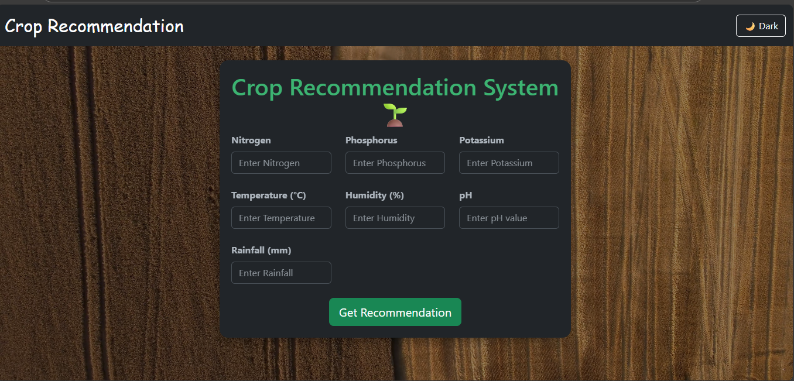

# 🌱 Crop Recommendation System  

This is a **Machine Learning + Flask web application** that recommends the most suitable crop for cultivation based on soil and environmental conditions.  

The project was built using:  
- 🧑‍💻 **Jupyter Notebook & VS Code** for development  
- 📊 **Dataset from Kaggle** (agricultural dataset)  
- 🤖 **Machine Learning (Scikit-learn)** for training and predictions  
- 🌐 **Flask + HTML/CSS** for the web interface  

---

## 📌 Features
- Input soil and environmental parameters (N, P, K, temperature, humidity, pH, rainfall).  
- Predict the best crop for the given conditions.  
- Simple, interactive web UI using Flask and HTML.  
- Trained ML model saved and used in production.  

---

## 🛠️ Tech Stack
- **Python Libraries**:  
  - NumPy  
  - Pandas  
  - Seaborn  
  - Scikit-learn  
  - Flask  
  - Matplotlib  
- **Frontend**: HTML, CSS, Bootstrap  
- **Jupyter Notebook**: Data preprocessing, EDA, model training  
- **Dataset**: Kaggle crop recommendation dataset  

---

## 📂 Project Structure
├── Crop_recommendation.ipynb # Jupyter Notebook (model training & EDA)<br>
├── Crop_recommendation.csv # Dataset from Kaggle<br>
├── app.py # Flask web app<br>
├── model.pkl # Trained ML model<br>
├── minmaxscalar.pkl<br>
├──standscalar.pkl<br>
├── templates/<br>
│ └── index.html # Frontend HTML template<br>
├── static/ # Static files (CSS, JS, images)<br>
└── README.md # Project documentation

---

## ⚡ How to Run Locally  
1. **Clone the repository**  
```bash
git clone https://github.com/YourUsername/Crop-Recommendation-System.git
cd Crop-Recommendation-System
```
2.**Add Dependencies**
```bash
pip install numpy pandas seaborn scikit-learn flask matplotlib pickle


```
3.Run Flask APP
```bash
python app.py
```
4.open in brower
```bash
http://127.0.0.1:5000/
```

## 🖼️ Screenshot

### Home Page


----
## 📊 Dataset

The dataset is taken from Kaggle – Crop Recommendation Dataset
 🌾

Features include:

Nitrogen (N), Phosphorus (P), Potassium (K)

Temperature, Humidity, pH, Rainfall

Target: Recommended crop

---
## 🚀Future Enhancements

Add real-time weather API to fetch live weather conditions.

Deploy the app on Heroku/Render for online access.

Extend dataset for regional-specific crops.

Add user authentication to save previous recommendations.

Improve frontend design with responsive UI and better visuals.

---
## 🤝Contributing

Pull requests are welcome! For major changes, please open an issue first to discuss what you would like to change.

## 📜License

This project is for educational purposes. Free to use with proper credits.


